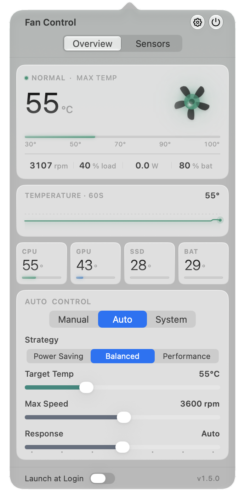
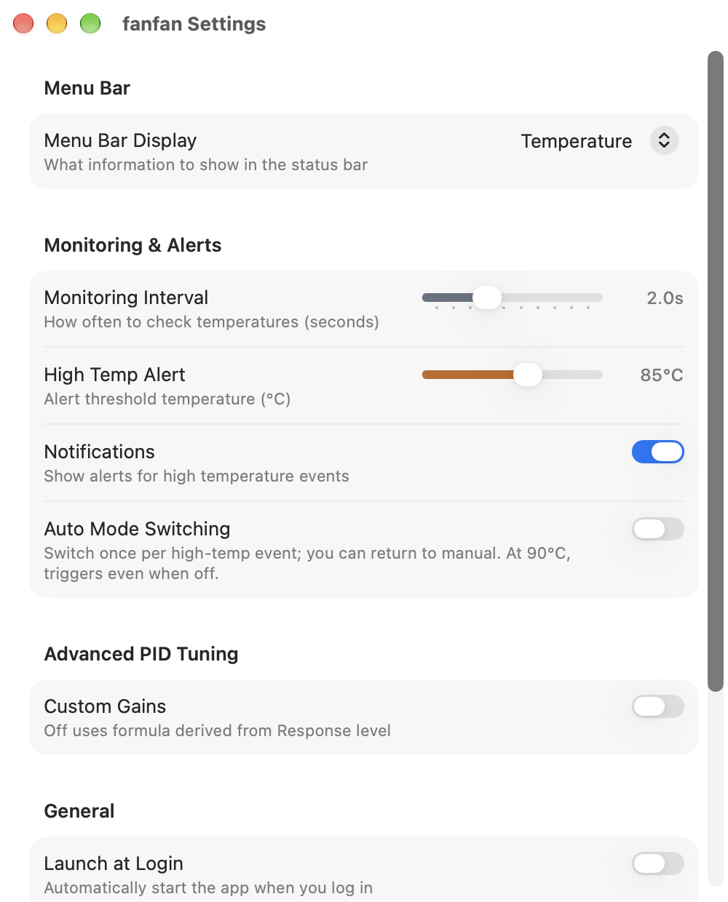

<div align="center">


# fanfan: Mac fan control and temperature monitor

A small open-source macOS menu bar app that shows your Mac's temperatures and lets you set fan speed.

[](https://github.com/hoobnn/fanfan/releases/latest)
[](https://github.com/hoobnn/fanfan/releases)
[](https://www.apple.com/macos/)
[](#homebrew)
[](LICENSE)

[简体中文](README.md) · **English**

</div>

fanfan sits in the menu bar and shows your Mac's temperatures and fan speeds. You can pin the fans to a fixed speed, let fanfan adjust them by temperature, or hand them back to macOS. It runs on Apple Silicon and Intel Macs with macOS 26 or later and has no third-party dependencies.

<table>
  <tr>
    <td width="42%" align="center"></td>
    <td width="58%" align="center"></td>
  </tr>
  <tr>
    <td align="center"><sub>Menu bar popover</sub></td>
    <td align="center"><sub>Settings</sub></td>
  </tr>
</table>

## Features

- Fan RPM plus CPU, GPU, SSD and battery temperatures, depending on which sensors your Mac has. The popover shows the last 60 seconds as a chart, and the Sensors tab lists every reading.
- Three fan modes: a fixed RPM, automatic control based on temperature, or the Mac's own firmware control. On Macs with two fans you can set each one separately.
- Automatic mode lets you change the target temperature, the maximum speed and how quickly it reacts. There are Power Saving, Balanced and Performance presets, or your own settings. Speed changes are smoothed (fast up, slow down) so the fans don't keep surging.
- The menu bar item can show temperature, power draw, fan speed as a percentage, or just the icon.
- A notification when the temperature passes a limit you set, with an option to switch to automatic mode at the same time.
- Custom PID gains if none of the presets suit your workload.
- English, 简体中文, 繁體中文, 日本語, 한국어, Deutsch, Français and Español. fanfan follows the system language, or you can set its language on its own in System Settings › General › Language & Region › Applications.
- Fan speeds are written by a separate privileged helper. If the app hangs for more than 10 seconds, quits or crashes, the fans go back to macOS control.

Fan controls are hidden on Macs without a fan. Which sensors you see and the available speed range depend on the model.

## Install

### Homebrew

```bash
brew tap hoobnn/tap
brew install --cask fanfan
```

### Manual

Download the latest DMG from [Releases](https://github.com/hoobnn/fanfan/releases/latest), or use the install script:

```bash
curl -fsSL https://raw.githubusercontent.com/hoobnn/fanfan/main/scripts/install.sh | bash
```

Requires macOS 26 or later (Apple Silicon or Intel). On first launch, click **Install Helper**, then allow fanfan in System Settings › General › Login Items & Extensions. No administrator password needed.

### Uninstall

`brew uninstall --cask fanfan` removes the app and the helper; add `--zap` to remove preferences too. If you installed it manually, quit fanfan and delete it from Applications. The helper lives inside the app bundle and stops with it. If a fanfan entry is still listed under Login Items & Extensions, remove it there.

## FAQ

**Is it safe to change fan speed?**
fanfan only sets speeds between the minimum and maximum RPM the fan reports, and the helper rejects anything outside that range. If the app crashes, hangs or quits, the fans go back to macOS firmware control.

**Does it work on Apple Silicon (M-series) Macs?**
Yes. It's a universal app for Apple Silicon and Intel on macOS 26 or later. Fanless models such as the MacBook Air only show temperatures.

**Why does it ask to run in the background?**
Writing fan speeds to the SMC needs root. So that the app itself doesn't run as root, fanfan registers a small root helper, and macOS asks you to allow it once in Login Items & Extensions. Reading temperatures needs no extra permission.

**How does it compare with Macs Fan Control or smcFanControl?**
It does the same core job: read SMC sensors and set fan speeds. fanfan is free, open source (MIT) and has no third-party dependencies.

## How it works

The app runs as your normal user and reads temperatures directly through IOKit.

Writing fan speeds needs root, so that part is a small LaunchDaemon written in C (`fanfan-smcd`, registered with `SMAppService`). It holds the SMC handle and takes a few kinds of requests over a small versioned XPC protocol: health checks, lease renewal, fan targets, and handing control back to firmware. Only the fanfan app signed by its developer can connect. When the app quits or crashes, the fans go back to firmware right away; if the app hangs, the 10-second lease runs out and the same thing happens.

```text
fanfan.app  ──XPC──▶  fanfan-smcd (root)  ──IOKit──▶  SMC
```

## Build from source

Requires Xcode with the macOS 26 SDK.

```bash
make -C tools/fanfan-smcd                                   # build the helper
cp tools/fanfan-smcd/fanfan-smcd fanfan/Resources/fanfan-smcd
xcodebuild -project fanfan.xcodeproj -scheme fanfan -configuration Debug build
```

## Star history

<a href="https://star-history.com/#hoobnn/fanfan&Date">
  <picture>
    <source media="(prefers-color-scheme: dark)" srcset="https://api.star-history.com/svg?repos=hoobnn/fanfan&type=Date&theme=dark" />
    <source media="(prefers-color-scheme: light)" srcset="https://api.star-history.com/svg?repos=hoobnn/fanfan&type=Date" />
    
  </picture>
</a>

## Acknowledgements

fanfan started as a fork of [solofan](https://github.com/SoloTeamDev/solofan) (formerly ffan). Thanks to the solofan team.

[MIT](LICENSE) © 2026 hoobnn
