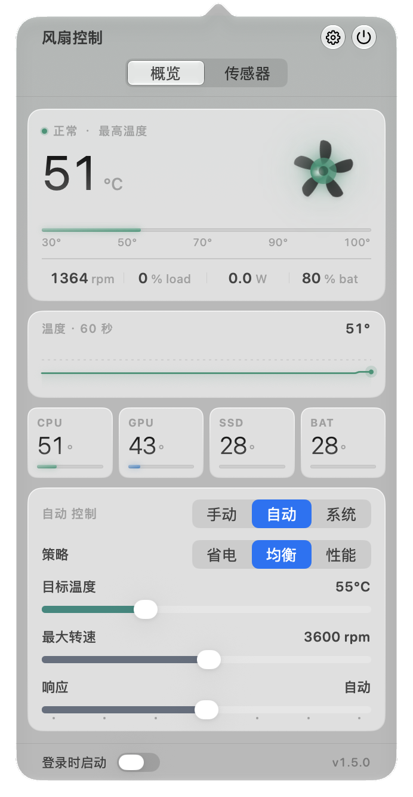
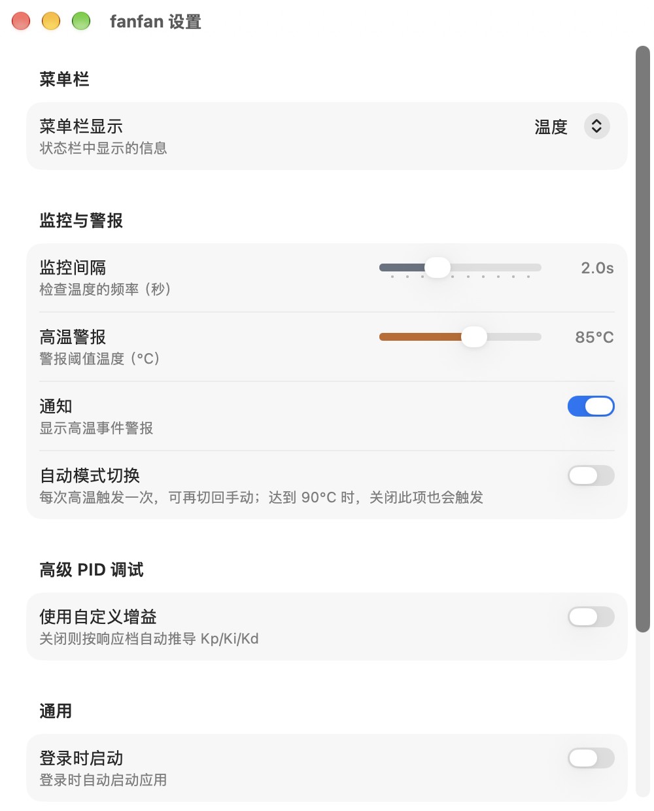

<div align="center">


# fanfan — Mac 风扇控制与温度监控

**开源的 macOS 菜单栏应用：查看 Mac 温度，手动、自动或交给系统控制风扇转速。**

[](https://github.com/hoobnn/fanfan/releases/latest)
[](https://github.com/hoobnn/fanfan/releases)
[](https://www.apple.com/macos/)
[](#安装)
[](#homebrew)
[](https://swift.org)
[](LICENSE)

简体中文 · [English](README.md)

</div>

fanfan 是一款开源 macOS 菜单栏应用，可查看 Mac 温度和风扇转速，手动设置转速、按温度自动调速，或交还 macOS 固件控制。支持运行 macOS 26 及以上版本的 Apple Silicon 和 Intel Mac，无任何第三方依赖。

<table>
  <tr>
    <td width="42%" align="center"></td>
    <td width="58%" align="center"></td>
  </tr>
  <tr>
    <td align="center"><sub>菜单栏面板</sub></td>
    <td align="center"><sub>设置</sub></td>
  </tr>
</table>

## 功能

- **监控设备状态：** 查看风扇转速，以及可用的 CPU、GPU、SSD 和电池温度传感器读数；附 60 秒温度曲线，「传感器」页可看详细读数。
- **选择风扇模式：** 支持手动设置转速、按温度自动调速和恢复系统固件控制；多风扇 Mac 可分别设置转速。
- **调整自动调速：** 设置目标温度、最大转速和响应速度，并可选省电、均衡、性能或自定义设置；平滑与非对称爬坡避免风扇忽快忽慢的“喘振”。
- **菜单栏一眼可见：** 菜单栏可显示温度、功耗或风扇转速百分比，也可以什么都不显示。
- **高温警报：** 超过设定阈值时发送通知，并可自动切换到自动调速。
- **高级 PID 调试：** 预设不合适时，可自定义控制器增益。
- **多语言界面：** 支持 English、简体中文、繁體中文、日本語、한국어、Deutsch、Français 和 Español。默认跟随 macOS 系统语言，也可以在 系统设置 › 通用 › 语言与地区 › 应用程序 里单独为 fanfan 指定语言。
- **自动恢复控制：** 风扇写入由独立的特权辅助进程完成；应用失去响应后，10 秒租约到期会交还固件控制。退出应用时也会先把风扇交还给 macOS。

无风扇的 Mac 不显示风扇控制项。可用传感器和转速范围因机型而异。

## 安装

### Homebrew

```bash
brew tap hoobnn/tap
brew install --cask fanfan
```

### 手动安装

从 [Releases](https://github.com/hoobnn/fanfan/releases/latest) 下载最新 DMG，或运行安装脚本：

```bash
curl -fsSL https://raw.githubusercontent.com/hoobnn/fanfan/main/scripts/install.sh | bash
```

需要 macOS 26+（Apple Silicon 或 Intel）。首次启动点击「安装助手」，然后在 系统设置 › 通用 › 登录项与扩展 中允许 fanfan 即可，无需输入管理员密码。

### 卸载

`brew uninstall --cask fanfan` 会同时移除应用和辅助进程（加 `--zap` 连偏好设置一起清理）。手动安装的话，退出 fanfan 并从「应用程序」删除即可——辅助进程在应用包内，会随之停止。「登录项与扩展」里残留的 fanfan 条目可在那里手动移除。

## 常见问题

**调 Mac 风扇转速安全吗？**
fanfan 只在硬件自身允许的范围内设置转速——辅助进程会拒绝超出风扇上报的最低、最高转速的请求。应用崩溃、卡死或退出时，风扇都会自动交还 macOS 固件控制。

**支持 Apple Silicon（M 系列）Mac 吗？**
支持。fanfan 是 Apple Silicon 与 Intel 通用应用，要求 macOS 26 及以上。Apple Silicon MacBook Air 等无风扇机型只显示温度。

**为什么要允许在后台运行？**
向 SMC 写入风扇转速需要 root 权限。fanfan 不让整个应用以 root 运行，而是注册一个极简的 root 辅助进程，由 macOS 在「登录项与扩展」里请你允许一次；读取温度不需要任何特殊权限。

**fanfan 能替代 Macs Fan Control 或 smcFanControl 吗？**
它做的是同一件核心的事——读取 SMC 传感器、设置风扇转速——以免费、MIT 许可、开源且无第三方依赖的菜单栏应用形式提供。

## 工作原理

写入风扇转速需要 root 权限。fanfan 不让整个应用以 root 运行，
而是经 `SMAppService` 注册一个极简的 C LaunchDaemon，由它持有 SMC 句柄，
通过带版本的精简 XPC 协议完成健康检查、租约续期、转速写入和固件控制恢复。
只有开发者签名的 fanfan 应用才能连接。应用退出或崩溃时风扇立即交还固件控制；
应用卡死时由 10 秒租约兜底。

```
fanfan.app  ──XPC──▶  fanfan-smcd（root）  ──IOKit──▶  SMC
```

应用本身以普通用户身份运行，温度读取直接走 IOKit。

## 从源码构建

需要带 macOS 26 SDK 的 Xcode。

```bash
make -C tools/fanfan-smcd                                   # 构建辅助进程
cp tools/fanfan-smcd/fanfan-smcd fanfan/Resources/fanfan-smcd
xcodebuild -project fanfan.xcodeproj -scheme fanfan -configuration Debug build
```

## Star 增长

<a href="https://star-history.com/#hoobnn/fanfan&Date">
  <picture>
    <source media="(prefers-color-scheme: dark)" srcset="https://api.star-history.com/svg?repos=hoobnn/fanfan&type=Date&theme=dark" />
    <source media="(prefers-color-scheme: light)" srcset="https://api.star-history.com/svg?repos=hoobnn/fanfan&type=Date" />
    
  </picture>
</a>

## 致谢

Fork 自 [solofan](https://github.com/SoloTeamDev/solofan)（原名 ffan），感谢 solofan 团队。

[MIT](LICENSE) © 2026 hoobnn
